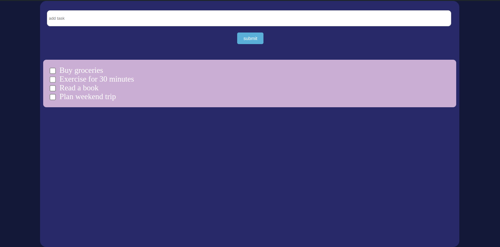

# To-Do List App

## Overview

This simple to-do list app uses Flask for the backend and JavaScript for the frontend.




## Getting Started

### Prerequisites

Make sure you have the following installed:

- Python 3.x
- Flask
- Flask-RESTful
- Flask-SQLAlchemy
- Node.js (for JavaScript dependencies)

### Installation

1. Clone the repository:

   ```
   git clone https://github.com/ITSHAYDER/To-do-app-Flask.git
   cd your-repository-name
   ```
2. Set up the Python environment:
   ```
   python -m venv venv
   source venv/bin/activate  # On Windows use `venv\Scripts\activate`
